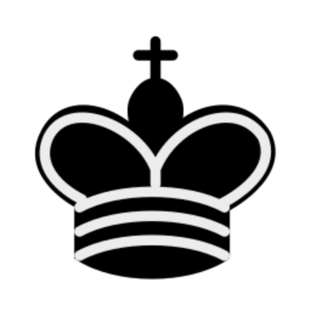

[![Contributors][contributors-shield]][contributors-url]
[![Forks][forks-shield]][forks-url]
[![Stargazers][stars-shield]][stars-url]
[![Issues][issues-shield]][issues-url]

<!-- PROJECT LOGO -->
<br />
<p align="center">
  <a href="https://github.com/othneildrew/Best-README-Template">
    
  </a>

  <h3 align="center">KChess</h3>

  <p align="center">
    An awesome open source Chess program for playing and learning chess. Built using electron JS for cross platform (Mac, Windows, Linux) support. This project is far from complete it is still in the early days of development.
    <br />
<hr />
<br />
</p>

<!-- TABLE OF CONTENTS -->
<details open="open">
  <summary>Table of Contents</summary>
  <ol>
    <li>
      <a href="#about-the-project">About The Project</a>
      <ul>
        <li><a href="#built-with">Built With</a></li>
      </ul>
    </li>
    <li>
      <a href="#getting-started">Getting Started</a>
      <ul>
        <li><a href="#prerequisites">Prerequisites</a></li>
        <li><a href="#installation">Installation</a></li>
      </ul>
    </li>
    <li><a href="#roadmap">Roadmap</a></li>
    <li><a href="#contributing">Contributing</a></li>
    <li><a href="#contact">Contact</a></li>
  </ol>
</details>

<!-- ABOUT THE PROJECT -->

## About The Project

<!-- [![Product Name Screen Shot][product-screenshot]](https://example.com) -->

There are many great Chess software available, however, I didn't find one that really suit my needs so I am creating this chess software. I want to create a Chess software so amazing that it'll be the last one you ever need. A truly cross platform and open-source Chess software which will run on windows, Linux and Mac. This chess software aims to bring modern UI, a collection of great chess tools for learning and improving at this game.

Here's why:

- Your time should be focused on improving at chess. A project that solves a problem and helps others
- You should get a completely free cross platform Chess experience.
- A native software which can truly make use of you're hardware.

### Built With

This project is being built using many open-source tools and technologies without these it would have been impossible to create such a tool. I might have missed some of libraries please feel free to make a PR for the same.

- [Electron JS](https://www.electronjs.org/)
- [Stock Fish Chess](https://stockfishchess.org/)
- [Vue JS](https://vuejs.org/)
- [Tailwind CSS](https://tailwindcss.com/)

<!-- GETTING STARTED -->

## Getting Started

To get a local copy up and running follow these simple example steps.

### Prerequisites

These are the pre-requisite to start development.

- Node JS
- [Yarn Package manager](https://yarnpkg.com/)

    ```SH
    npm install -g yarn
    ```

- VS Code (Optional)

### Installation

1. Clone the repo

   ```sh
   git clone https://github.com/ketansingrole/KChess/
   ```

1. Install NPM packages

   ```sh
   yarn install
   ```

1. Start electron in Dev environment

   ```sh
   electron:serve
   ```

1. Build electron Project

    ```sh
    electron:build
    ```
<!-- ROADMAP -->
## Roadmap

- Creating the basic Chess software and the architecture.

- Adding tools to support Chess Learning.

- Adding stockfish support.

- Playing with online players using Lichess.

See the [open issues](https://github.com/othneildrew/Best-README-Template/issues) for a list of proposed features (and known issues).

<!-- CONTRIBUTING -->

## Contributing

Contributions are what make the open source community such an amazing place to be learn, inspire, and create. Any contributions you make are **greatly appreciated**.

1. Fork the Project
2. Create your Feature Branch (`git checkout -b feature/AmazingFeature`)
3. Commit your Changes (`git commit -m 'Add some AmazingFeature'`)
4. Push to the Branch (`git push origin feature/AmazingFeature`)
5. Open a Pull Request

<!-- CONTACT -->

## Contact

Ketan Singrole - [@KSingrole](https://twitter.com/KSingrole) - singroleketan@gmail.com

Project Link: [https://github.com/ketansingrole/KChess](https://github.com/ketansingrole/KChess)

[contributors-shield]: https://img.shields.io/github/contributors/ketansingrole/KChess?style=for-the-badge
[contributors-url]: https://github.com/ketansingrole/KChess/graphs/contributors
[forks-shield]: https://img.shields.io/github/forks/ketansingrole/KChess?style=for-the-badge
[forks-url]: https://github.com/ketansingrole/KChess/network/members
[stars-shield]: https://img.shields.io/github/stars/ketansingrole/KChess?style=for-the-badge
[stars-url]: https://github.com/ketansingrole/KChess/stargazers
[issues-shield]: https://img.shields.io/github/issues/ketansingrole/KChess?style=for-the-badge
[issues-url]: https://github.com/ketansingrole/KChess/issues
